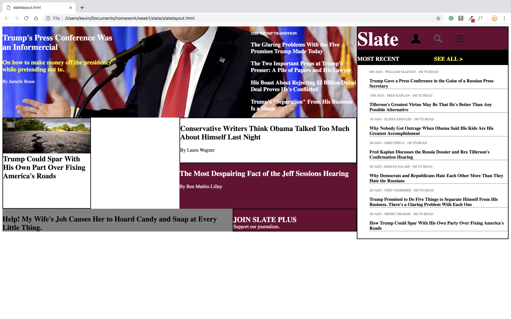

# Mock Slate Web Page
I tried to duplicate the slate home page.

## How It's Made:

**Tech used:** HTML, CSS, JavaScript

I started with laying out the html of the webpage. After that was done, I used css to try and recreate the layout of the web page as close as possible.

## Lessons Learned:

I learned how to use html and css together to create a web page.
